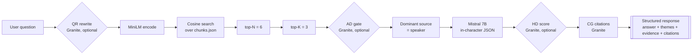
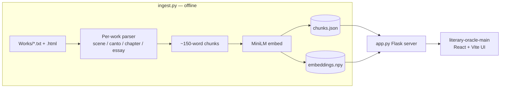

# Ask Lit Hum

A retrieval-augmented literary conversation system for Columbia's Literature Humanities core curriculum. Pose a thematic question; a speaker is chosen from the dominant source among the top retrieved passages and answers in character, grounded only in the text.

## Demo

A recorded walkthrough of the live app — real backend, real Ollama, real Mistral generation. Two canonical questions (*"What does it mean to live an authentic life?"* → Montaigne; *"How does love survive disappointment?"* → Anna Karenina).

https://github.com/ddrisco11/AskLitHum/releases/download/demo-v1/demo.mp4

<p><em>If the embed above doesn't auto-render in your markdown client, use this fallback:</em></p>

<video width="720" controls muted loop playsinline poster="video_output/demo_poster.png">
  <source src="https://github.com/ddrisco11/AskLitHum/releases/download/demo-v1/demo.mp4" type="video/mp4">
  <a href="https://github.com/ddrisco11/AskLitHum/releases/download/demo-v1/demo.mp4">Download the MP4</a>
</video>

▶ **Download / direct link**: [demo.mp4 · release demo-v1](https://github.com/ddrisco11/AskLitHum/releases/download/demo-v1/demo.mp4) (1.2 MB · 45 s · 1280×800 H.264)

Recording: [`record_demo.py`](./record_demo.py) — Playwright driving the real UI. Edit: [`edit_demo.py`](./edit_demo.py) — ffmpeg segment cuts, speed ramps, drawtext captions, concat demuxer.

The project pairs a classical RAG stack (MiniLM embeddings + cosine retrieval + Mistral generation) with IBM's **Granite** adapter suite for post-generation auditing — hallucination scoring and per-span citation — so every answer is not just in-character but traceable back to the text.

---

## Pipeline



Ingest is one-shot and runs offline; the server only does retrieval and generation.



### Why "dominant source = speaker"

Rather than asking the user which character to consult, the system infers the speaker from retrieval. Whichever work contributes the most passages in the top-K becomes the persona. This keeps the interface thematic — the reader asks a question; the library answers.

### Granite adapter stages

| Stage | Name | Role | Default |
| :---- | :--- | :--- | :------ |
| QR | Query Rewrite | Clarify pronouns, expand vague queries | off |
| CR | Context Relevance | Score each passage 0–1 (display only) | off |
| AD | Answerability | Gate whether the top-K can answer at all | off |
| HD | Hallucination | Score how grounded the generated answer is | off |
| CG | Citation Generation | Align answer spans to source passages | **on** |

All toggled via `GRANITE_STAGES="CG,HD,QR,..."`. CR and AD are factual-QA classifiers that score thematic matches near zero, so they ship off by default; CG is the most informative signal for an interpretive app and ships on.

---

## Works in the corpus

All sources are public-domain and loaded locally; nothing is fetched at query time.

| Work | Author | Source | Granularity | Chunks | % of corpus |
| :--- | :----- | :----- | :---------- | -----: | ----------: |
| *Inferno* | Dante Alighieri | PG #8800 | Canto | 272 | 5.6% |
| *Confessions* | Saint Augustine | Local HTML | Book | 750 | 15.4% |
| *Pride and Prejudice* | Jane Austen | PG #1342 | Chapter | 836 | 17.1% |
| *King Lear* | William Shakespeare | PG #100 (modernized) | Act, Scene | 185 | 3.8% |
| *Anna Karenina* | Leo Tolstoy (Garnett tr.) | PG #1399 | Part, Chapter | 2,413 | 49.5% |
| *Essays* (selected) | Michel de Montaigne (Cotton/Hazlitt tr.) | PG #3600 | Essay | 420 | 8.6% |
| **Total** | | | | **4,876** | 100% |

### Montaigne — selected essays only

Per the Literature Humanities syllabus, only these eight essays are ingested (not the full *Essais*):

1. Epistle to the Reader ("The Author to the Reader")
2. Of Idleness
3. Of the Power of the Imagination ("Of the Force of Imagination" in Cotton/Hazlitt)
4. Of Democritus and Heraclitus
5. Of Repentance
6. Of Experience
7. Of Cannibals
8. Of Coaches

The loader extracts each by matching its heading and scanning until the next chapter / book / signature boundary.

### Speakers

| Work | Speaker | Voice register |
| :--- | :------ | :-------------- |
| *Inferno* | Dante | Pilgrim-poet; moral geography, particular images |
| *Confessions* | Augustine | Address God even when answering the asker; restless heart |
| *Pride and Prejudice* | Elizabeth Bennet | Austen's poise — polite, ironic, reflective |
| *King Lear* | King Lear | Shakespearean blank-verse cadence; elemental, self-accusing |
| *Anna Karenina* | Anna Karenina | Luminous and divided — desire against duty |
| *Essays* | Montaigne | First-person *essai*; digressive, quotes himself against himself, "Que sais-je?" |

---

## Setup and run

```bash
# 1. Python environment
python3 -m venv .venv
.venv/bin/pip install -r requirements.txt   # flask, sentence-transformers, scikit-learn, ollama, bs4, transformers

# 2. Build the retrieval index (one-shot; rerun when Works/ changes)
.venv/bin/python ingest.py

# 3. Start Ollama + pull the generator (one-time)
ollama pull mistral:7b-instruct-q4_0
ollama serve &

# 4. Start the Flask API
.venv/bin/python app.py        # http://127.0.0.1:5001

# 5. Start the React UI
cd literary-oracle-main && npm install && npm run dev   # http://127.0.0.1:8080
```

`GET /health` reports chunk count, embedding shape, model name, and enabled Granite stages. `POST /ask` with `{"question": "..."}` returns the structured response.

---

## Retrieval-routing simulation

To understand **which speaker the pipeline tends to hand a question to**, we ran a 300-query study over six thematic categories and recorded, for each query, which character was chosen by the dominant-source rule. No generation was performed — this study isolates the retrieval + routing behavior that precedes the LLM.

### Methodology

- **Query generator**: `google/flan-t5-base` (250 M parameters), few-shot prompted with 3 gold-standard example questions per category drawn from a pool of 12. Sampling with `temperature=0.95`, `top_p=0.92`, `repetition_penalty=1.25`. A post-filter rejects category-name parrots ("What are moral / ethical questions?"), meta-literary questions ("How is this character portrayed?"), and malformed output (<20 chars, missing verb, duplicate).
- **Retriever**: identical to production — `all-MiniLM-L6-v2` encoder, cosine similarity, `RETRIEVE_N=6`, `TOP_K=3`.
- **Routing**: dominant work among top-3 → character (same `pick_responder` logic as `app.py`).
- **Scale**: 50 queries × 6 categories = 300 total. Fixed `SEED=17` for reproducibility.
- **Categories**: Human condition & identity; Social & cultural structures; Existential / philosophical; Interpersonal relationships; Conflict & struggle; Moral / ethical questions.

Script: [`simulate.py`](./simulate.py). Raw results: [`simulation_results.json`](./simulation_results.json).

### Overall speaker distribution (n = 300)

| Speaker | Queries routed | Share |
| :------ | -------------: | ----: |
| Montaigne | 119 | 39.7% |
| Anna Karenina | 99 | 33.0% |
| Augustine | 64 | 21.3% |
| Elizabeth Bennet | 17 | 5.7% |
| Dante | 1 | 0.3% |
| King Lear | 0 | 0.0% |

**Mean top-1 cosine similarity**: 0.415.
**Queries with no majority in top-K** (three different works): 40 / 300 = 13.3%. These are resolved by `max()` picking the first source with the highest vote count — not a deadlock.

### Per-category routing (50 queries each)

| Category | Dante | Augustine | E. Bennet | Lear | A. Karenina | Montaigne |
| :------- | ----: | --------: | --------: | ---: | ----------: | --------: |
| Human condition & identity | 2% | 22% | 4% | 0% | 20% | **52%** |
| Social & cultural structures | 0% | 12% | 6% | 0% | 34% | **48%** |
| Existential / philosophical | 0% | **48%** | 0% | 0% | 24% | 28% |
| Interpersonal relationships | 0% | 10% | 16% | 0% | **46%** | 28% |
| Conflict & struggle | 0% | 22% | 2% | 0% | **44%** | 32% |
| Moral / ethical questions | 0% | 14% | 6% | 0% | 30% | **50%** |

Bold = category winner.

### Observations

- **Category winners line up with each work's actual concerns.** Augustine takes philosophical/existential questions (24/50); Anna Karenina takes interpersonal relationships (23/50) and conflict & struggle (22/50); Montaigne takes human condition/identity (26/50), social structures (24/50), and moral/ethical reflection (25/50). This is the retrieval doing the right thing: the *Confessions* genuinely is a philosophical interrogation, Tolstoy genuinely is the novelist of marriage and strife, and Montaigne genuinely is the essayist of the examined self.

- **Corpus size is a thumb on the scale.** Anna Karenina contributes 49.5% of all chunks but only 33% of routing decisions, so size alone doesn't explain the result — but King Lear (3.8% of chunks) and *Inferno* (5.6%) almost never win. A larger `TOP_K`, stratified retrieval, or per-work weighting would rebalance this if desired.

- **Dante and Lear are nearly invisible in this regime.** Translated verse and Shakespearean stage-speech embed into corners of the MiniLM space that broad thematic English queries rarely reach. For Lear especially, vocabulary like "wretched", "filial", "bastard", "storm" is where queries would need to land to surface him. The easiest fix is concrete query language (or a QR rewrite stage that expands abstractions into the speaker's idiom).

- **Ambiguity is real but not crippling.** 13.3% of queries produce a 3-way split in top-K. Top-1 mean cosine of 0.415 is respectable for thematic RAG; the long tail of near-tie decisions suggests the routing would benefit from a small margin threshold before committing to a speaker.

### Caveats

- `flan-t5-base` queries are grammatical but sometimes generic ("What do we know about relationships?") or faintly modern ("How do we keep the world from falling apart?"). These do not degrade the routing study — MiniLM matches on meaning, not register — but they should be read as a stress-test distribution, not as real Lit Hum student prompts.
- The study measures *routing only*. Answer quality, hallucination rate, and citation fidelity are evaluated elsewhere (HD + CG stages) and are not part of this number.

**CITATION:**
Code and README.md co-authored by Claude Code as reflected in the version control
